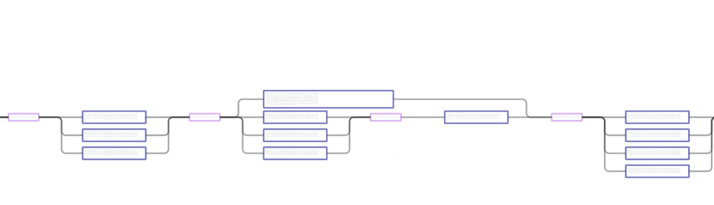
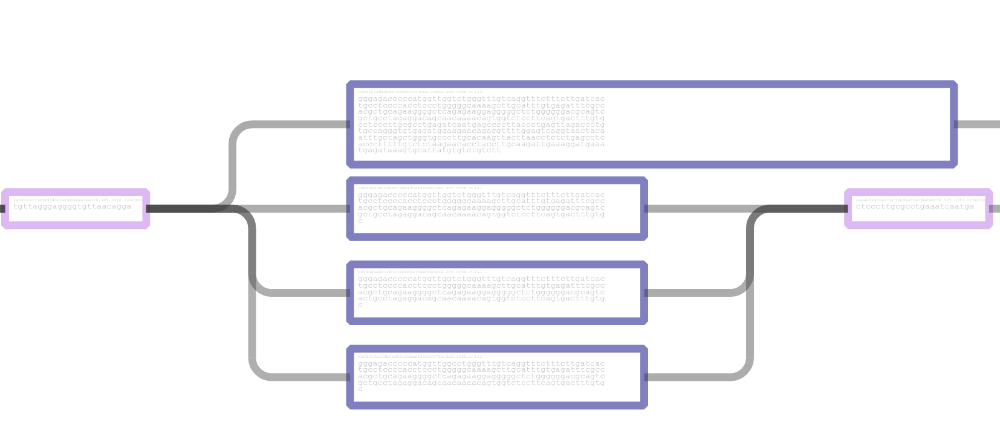

Lightning Graph Representation for the HGVM Pilot
===

Overview
---

This is code and supporting material for a [Lightning tile
representation](https://github.com/curoverse/lightning/blob/master/experimental/abram/Documentation/0-Overview.md) in relation to the HGVM pilot.


The [Human Genome Variant Map (HGVM) Pilot Project](https://github.com/ga4gh/schemas/wiki/Human-Genome-Variation-Map-%28HGVM%29-Pilot-Project) aims:

> ... to create a draft reference structure that represents all “common” genetic variation, providing a means to stably name and canonically identify each variant. ...

We've focused on the BRCA1 and BRCA2 regions specifically.

We're using a representation that is basically a more structured graph representation.
For this exercise we split sequences up into 'tags' and 'bodies', where tags are chosen
to be unique 24mers and the body sequences are chosen to be around 200bp long.
This follows our thinking about tiling the genome with overlapping tags.
Any variant that would fall on a tag is subsumed into a longer tile to keep the tag unaltered.


Our focus is only the BRCA1 and BRCA2 loci.  We've included the haplotype genomic information as referenced by the HGVM pilot project
page and also included the relevant portions of 174 participants from the Harvard Personal Genome Project.

This should be considered very experimental and a work in progress.

Quickstart
---

I've tried to make this repository as self contained as possible but dependencies will always be a problem.

Assuming you have all the appropriate dependencies:

```bash
$ git clone https://github.com/abeconnelly/hgvm-lighting-graph
$ cd hgvm-lightning-graph
$ ./bootstrap
```

Assuming everything went well, the final SQLite database file should be located in `db/tilegraph.sqlite3`.

Visualization
----

There is a [live demo](http://lightning-dev2.curoverse.com/light-graph-path-v0.2.0/) of a visualization for our graph representation.  Please be patient as the load can take a while.  For best results use Chromium.  Firefox works but is extremely slow.

Backing it is a portion of the SQLite database loaded into the browser with an HTML5 canvas for rendering.

Below are some screenshots:





  - **left mouse drag** to pan
  - **middle mouse wheel** to zoom

Purple boxes are 'tags' (24mer unique sequences) and blue boxes are 'body' tiles.  If you zoom in you can see the FASTA sequences making up the paths.  The dropdown in the upper left hand corner allows for selecting individual sample paths through the graph.

Code for the visualization resides in the `lightning_graph_viz` directory.

License
---

All code is AGPLv3.  All genomic data is CC0.

The Curoverse logo and name are trademarks of Curoverse, Inc.
